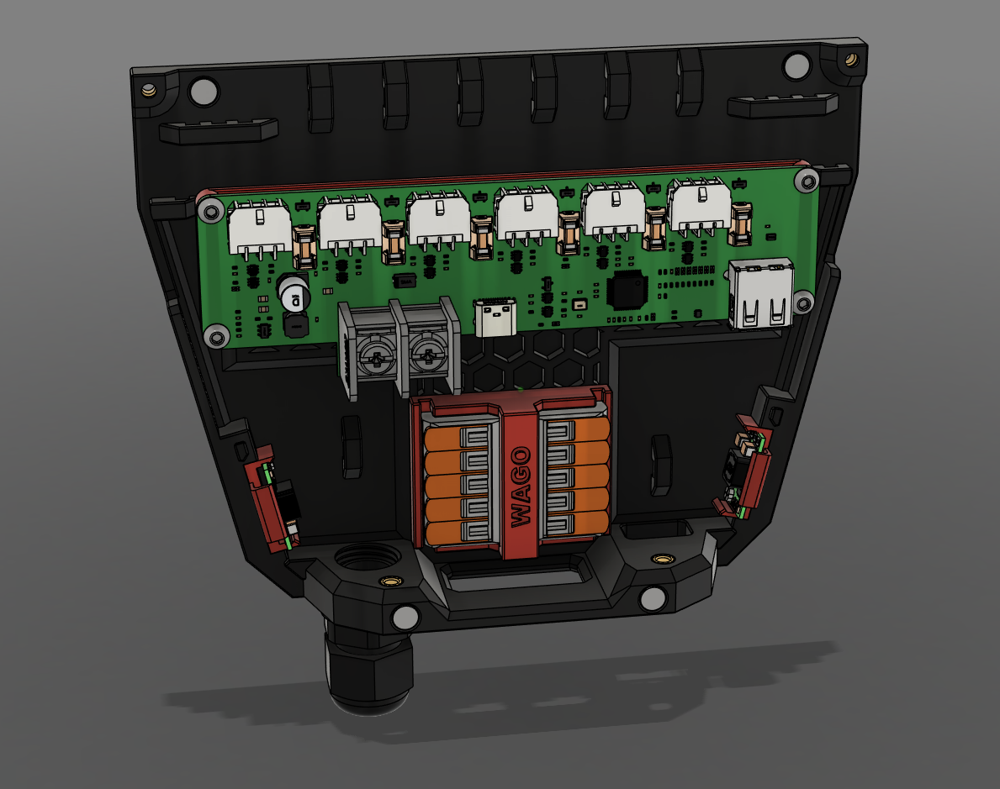
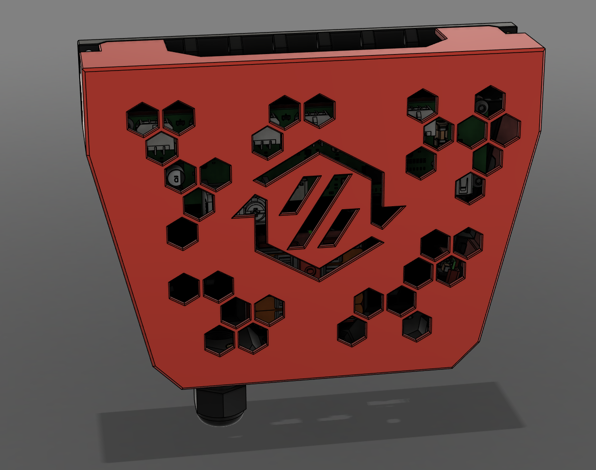

# Fanny Pack

Originally created by [EddieSha04](https://github.com/EddieSha04) aka [ManCheetah](https://www.printables.com/@EddieSha_454383) and adopted by DSD.

## DSD Changes

- Removed fans.
- Added modular mount system for PCBs.
- Added modular sub mount system for WAGOs and other boards.
- Added 2 places for [Mini DC-DC Buck Converters](https://www.aliexpress.com/item/32729546380.html).
- Added micron cover.
- Rotated hexes so they match all other project orientation.
- Make the hex spacing a uniform partern.

## Images

| Open | Closed |
| :-: | :-: |
|  |  |
