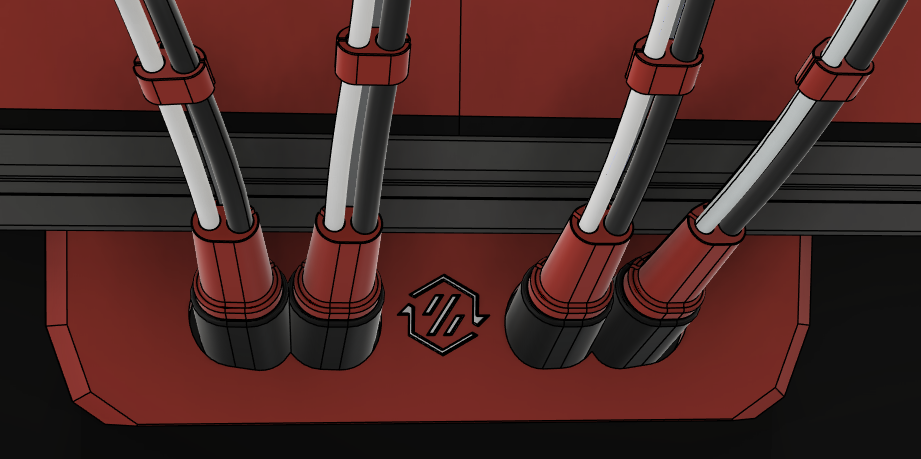

# Umbilical System

Originally created by [N3MI](https://github.com/N3MI-DG) and adopted by DSD.
The Original can be found [here](../../UserMods/N3MI-DG/Umbilical_plates_V2/).
## DSD Changes

- Added PTFE Ramp for FannyPack integration.
- Adapted Cover to attach to ramp and include ECAS mount.

## Images

