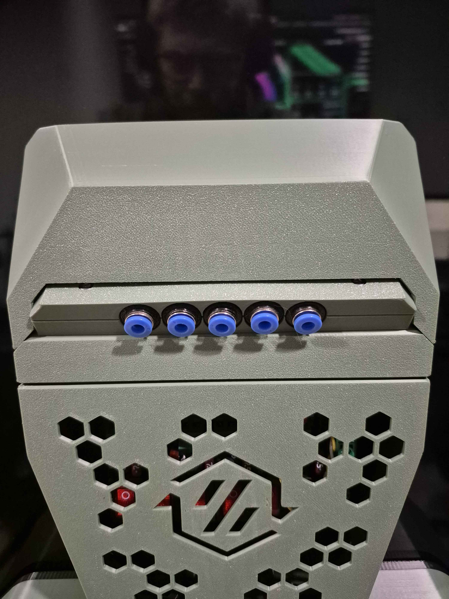
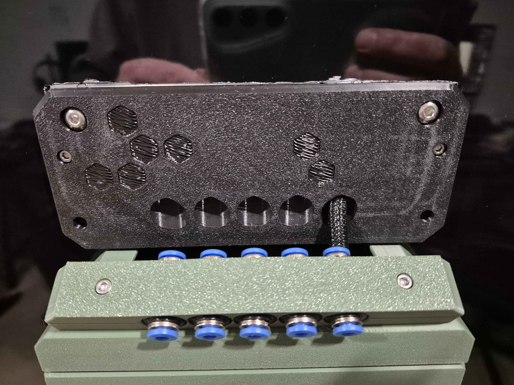

# PTFE Output Ramp Variations  
Single, Double, Triple, Four, Five and Six Way Variations for the PTFE Ramp on FannyPack
These are to be used in conjunction with N3MI's backplate. When I went to use this, I found that the PTFE I/O didn't align with the output ramp
which would cause very tight bends in the PTFE which would cause excessive drag on the filament.  In a bid to resolve this, I relocated the PTFE
Ramp Coupler positions to make them as straight as possible.  This requires no additional hardware than would be used for the original.

# Credits
- [N3MI-DG](https://github.com/N3MI-DG) for the Filament Entry Design this is based on

