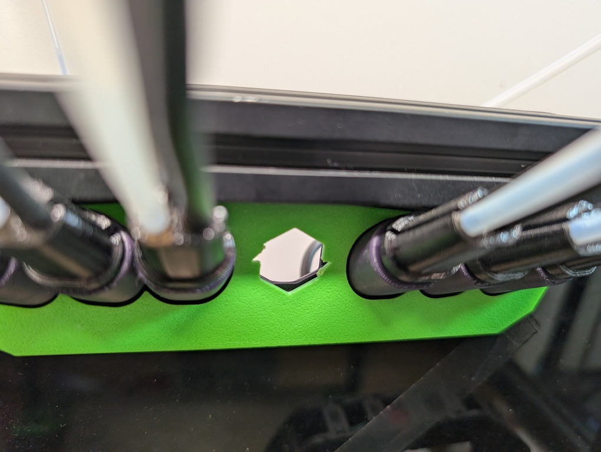
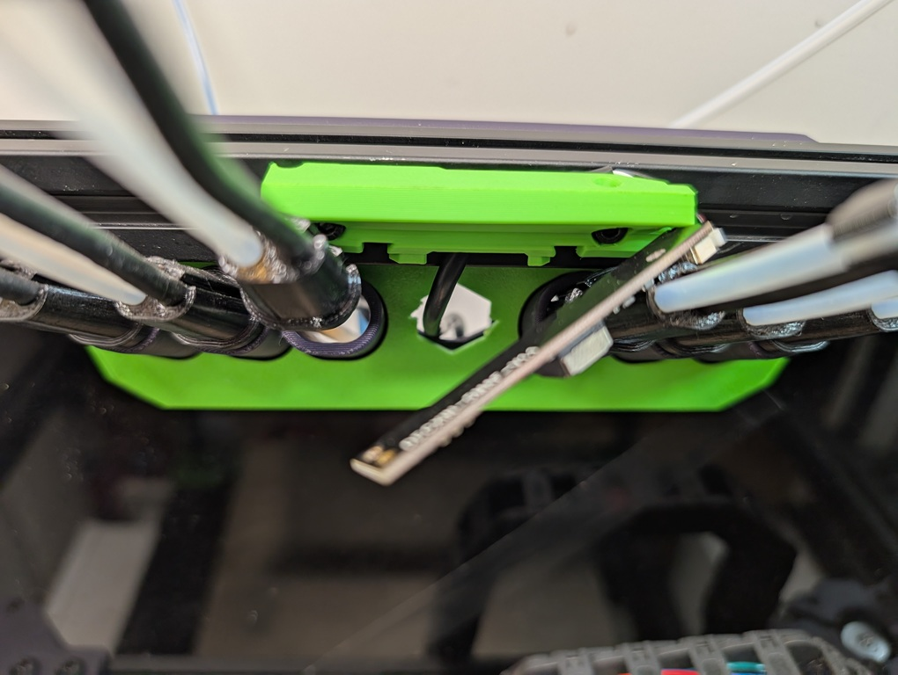
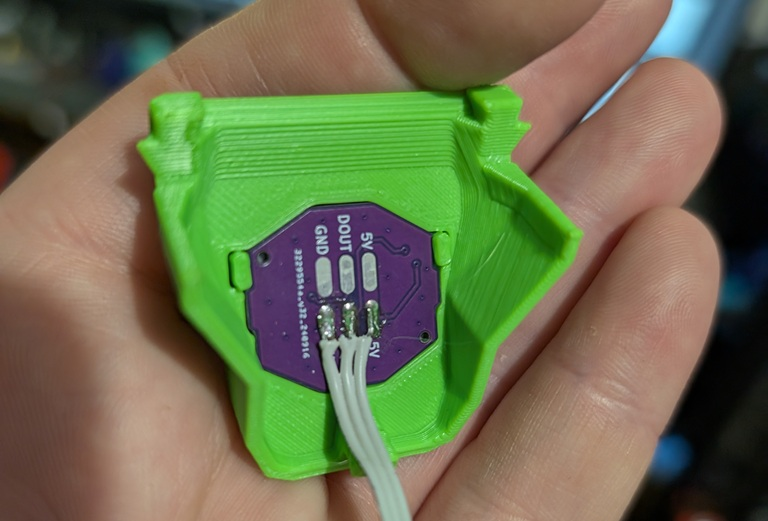
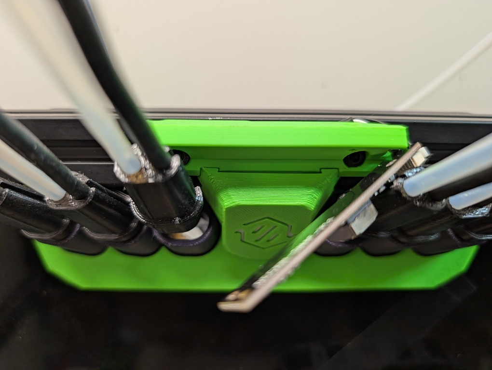
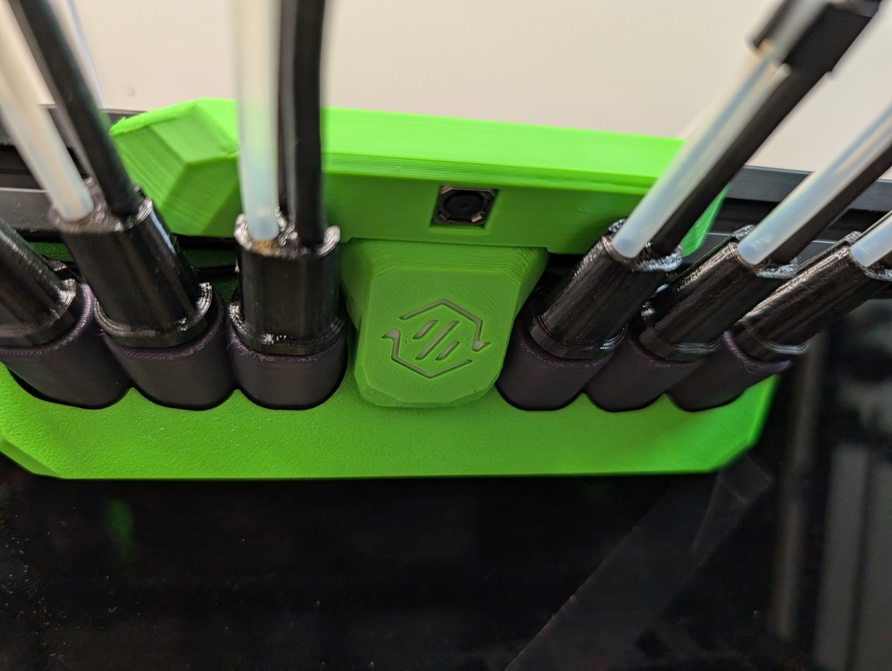
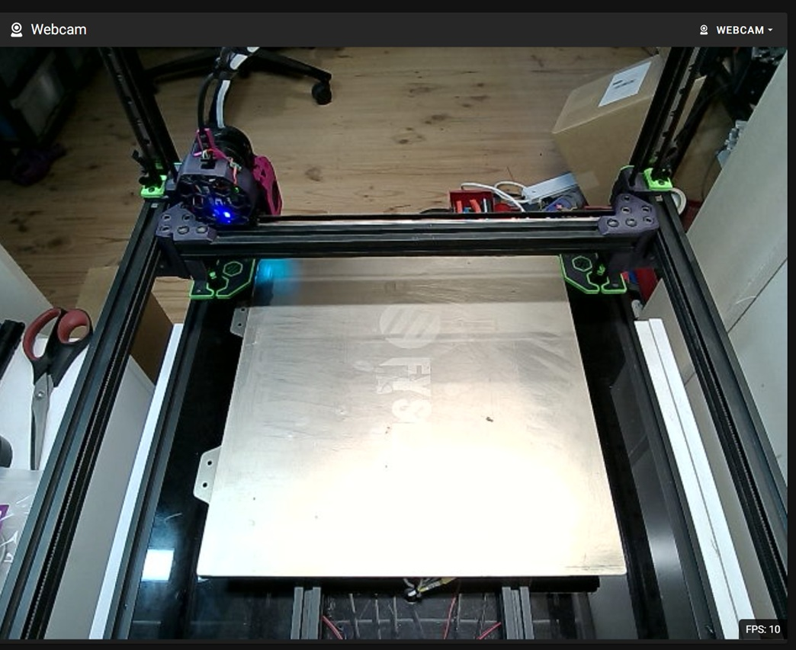

# Umbilical Plate Camera Addon
This addon is suitable for 250, 300 and 350 spec Voron Stealthchangers.

## BOM

- [OV5640 USB Camera Module](https://www.aliexpress.com/item/1005004703285622.html)
- 2x M2x10 Self Tapping Screws
- 2x M3x8 SHCS Screws
- 2x 2020 M3 Drop-in T-nuts

## Instructions

### Step 1

- If upgrading an existing setup, undo all the screws in the back plate and remove the existing insert before snipping out the logo.

- New installs should snip out the logo before anything is assembled.

### Step 2

- Attach the camera mount loosely with the 2 M3x8 SHCS screws and 2020 M3 drop-in T-nuts making sure the cable is routed behind the mount and through the hole of the umbilical plate.

### Step 3

- Install the insert to the lower cover and SC Barf LED if you have it. There are locating tabs on the insert piece, take not of their orientation.

### Step 4

- Install the lower cover ensuring the bottom tab is locked into the hole in the umbilical plate and the upper locating tabs are seated in the corresponding reliefs on the camera mount. This will center the camera. Once centered, tighten the 2 M3x8 SHCS screws.

### Step 5

- Sandwich the camera between the upper cover and camera mount and then install the 2 M2x10 self tapping screws from the top.

### Example image on a 300 Spec Voron

