# Umbilical System for StealthChanger

## Introduction
This umbilical system is ultimately made up of 2 components. The "Umbilical Plate" which mounts to the rear panel of your Voron V2 or Micron printer and the "Umbilical Restraints" that help tame the umbilical on its way to the tool head.
There are various combinations on how these components can be configured, choose wisely.
## Umbilical Plate
To choose the appropriate umbilical plate for your setup there are 6 things to consider.
- The type of printer you have.
- The size of the printer.
- The amount of tools you want to support.
- The type of umbilical you are using, TPU or Threaded.
- The width of the docks for the tools you are using.
- How the docks are positioned on the printer, Left, Right, Centered or Split.

The docks play a big role in this system and based on which tools you are using there can be 2 different nominal dock widths.

###### 60mm Nominal Width Docks
- Anthead
- Dragon Burner
- Mini StealthBurner
- Yavoth

###### 76mm Nominal Width Docks
- A4T
- Archetype Blackbird
- StealthBurner
- XOL

From the below tables, select the appropriate umbilical plate configuration for your setup.

Voron 250mm TPU 60mm Wide Dock

### Voron 250mm TPU 60mm Wide Dock
| Tool Count | Left | Right | Center | Split |
|-|-|-|-|-|
| 2 |[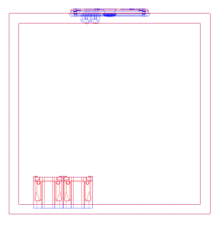](STL/Plates/Voron/250/2%20Tools/60mm%20Wide%20Dock/TPU/Left/) |[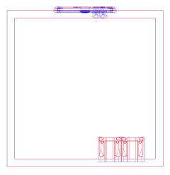](STL/Plates/Voron/250/2%20Tools/60mm%20Wide%20Dock/TPU/Right/) |[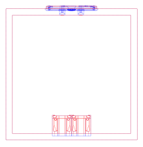](STL/Plates/Voron/250/2%20Tools/60mm%20Wide%20Dock/TPU/Center/) |[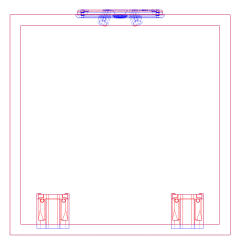](STL/Plates/Voron/250/2%20Tools/60mm%20Wide%20Dock/TPU/Split/) |
| 3 | - | - |[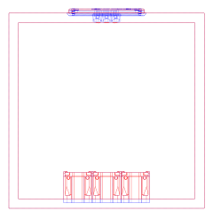](STL/Plates/Voron/250/3%20Tools/60mm%20Wide%20Dock/TPU/Center/) |[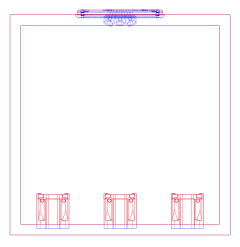](STL/Plates/Voron/250/3%20Tools/60mm%20Wide%20Dock/TPU/Split/) |
| 4 | - | - |[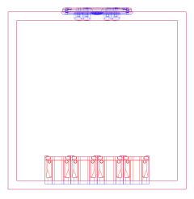](STL/Plates/Voron/250/4%20Tools/60mm%20Wide%20Dock/TPU/Center/) |[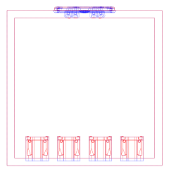](STL/Plates/Voron/250/4%20Tools/60mm%20Wide%20Dock/TPU/Split/) |
| 5 | - | - | - |[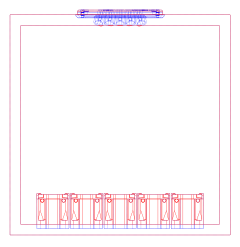](STL/Plates/Voron/250/5%20Tools/60mm%20Wide%20Dock/TPU/Split/) |

Voron 250mm TPU 76mm Wide Dock

### Voron 250mm TPU 76mm Wide Dock
| Tool Count | Left | Right | Center | Split |
|-|-|-|-|-|
| 2 |[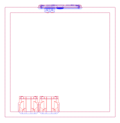](STL/Plates/Voron/250/2%20Tools/76mm%20Wide%20Dock/TPU/Left/) | |[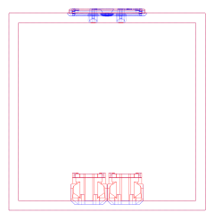](STL/Plates/Voron/250/2%20Tools/76mm%20Wide%20Dock/TPU/Center/) |[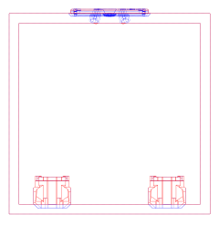](STL/Plates/Voron/250/2%20Tools/76mm%20Wide%20Dock/TPU/Split/) |
| 3 | - | - | |[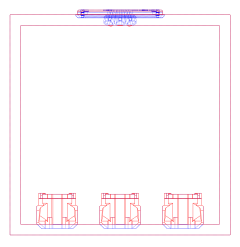](STL/Plates/Voron/250/3%20Tools/76mm%20Wide%20Dock/TPU/Split/) |
| 4 | - | - | - |[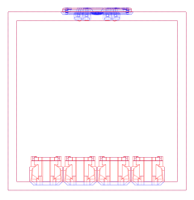](STL/Plates/Voron/250/4%20Tools/76mm%20Wide%20Dock/TPU/Split/) |

Voron 250mm Threaded 60mm Wide Dock

### Voron 250mm Threaded 60mm Wide Dock
| Tool Count | Left | Right | Center | Split |
|-|-|-|-|-|
| 2 |[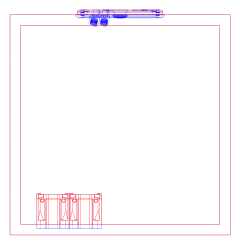](STL/Plates/Voron/250/2%20Tools/60mm%20Wide%20Dock/Threaded/Left/) |[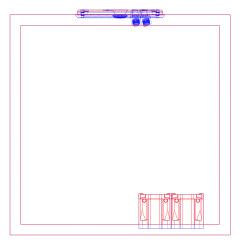](STL/Plates/Voron/250/2%20Tools/60mm%20Wide%20Dock/Threaded/Right/) |[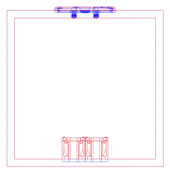](STL/Plates/Voron/250/2%20Tools/60mm%20Wide%20Dock/Threaded/Center/) |[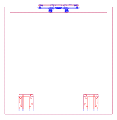](STL/Plates/Voron/250/2%20Tools/60mm%20Wide%20Dock/Threaded/Split/) |
| 3 | - | - |[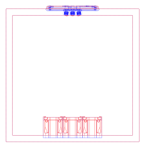](STL/Plates/Voron/250/3%20Tools/60mm%20Wide%20Dock/Threaded/Center/) |[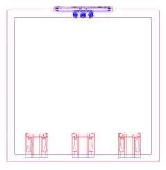](STL/Plates/Voron/250/3%20Tools/60mm%20Wide%20Dock/Threaded/Split/) |
| 4 | - | - |[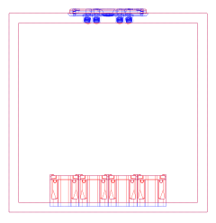](STL/Plates/Voron/250/4%20Tools/60mm%20Wide%20Dock/Threaded/Center/) |[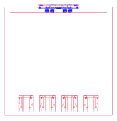](STL/Plates/Voron/250/4%20Tools/60mm%20Wide%20Dock/Threaded/Split/) |
| 5 | - | - | - |[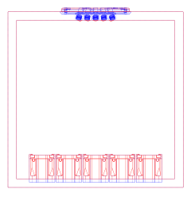](STL/Plates/Voron/250/5%20Tools/60mm%20Wide%20Dock/Threaded/Split/) |

Voron 250mm Threaded 76mm Wide Dock

### Voron 250mm Threaded 76mm Wide Dock
| Tool Count | Left | Right | Center | Split |
|-|-|-|-|-|
| 2 |[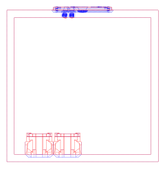](STL/Plates/Voron/250/2%20Tools/76mm%20Wide%20Dock/Threaded/Left/) |[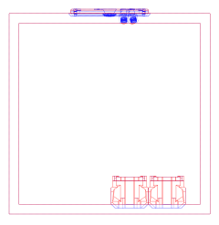](STL/Plates/Voron/250/2%20Tools/76mm%20Wide%20Dock/Threaded/Right/) |[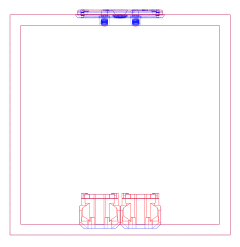](STL/Plates/Voron/250/2%20Tools/76mm%20Wide%20Dock/Threaded/Center/) | |
| 3 | - | - |[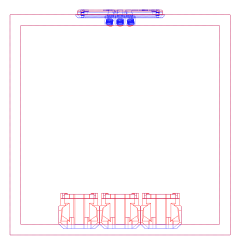](STL/Plates/Voron/250/3%20Tools/76mm%20Wide%20Dock/Threaded/Center/) |[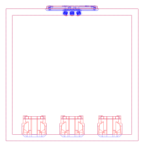](STL/Plates/Voron/250/3%20Tools/76mm%20Wide%20Dock/Threaded/Split/) |
| 4 | - | - | - |[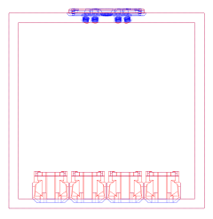](STL/Plates/Voron/250/4%20Tools/76mm%20Wide%20Dock/Threaded/Split/) |

Voron 300mm TPU 60mm Wide Dock

### Voron 300mm TPU 60mm Wide Dock
| Tool Count | Left | Right | Center | Split |
|-|-|-|-|-|
| 2 |[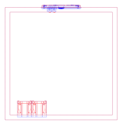](STL/Plates/Voron/300/2%20Tools/60mm%20Wide%20Dock/TPU/Left/) |[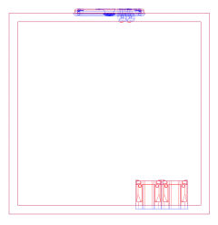](STL/Plates/Voron/300/2%20Tools/60mm%20Wide%20Dock/TPU/Right/) |[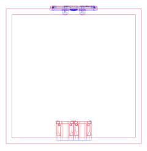](STL/Plates/Voron/300/2%20Tools/60mm%20Wide%20Dock/TPU/Center/) | |
| 3 |[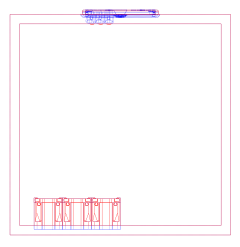](STL/Plates/Voron/300/3%20Tools/60mm%20Wide%20Dock/TPU/Left/) |[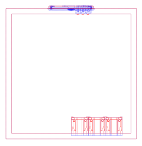](STL/Plates/Voron/300/3%20Tools/60mm%20Wide%20Dock/TPU/Right/) |[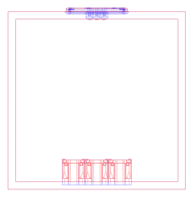](STL/Plates/Voron/300/3%20Tools/60mm%20Wide%20Dock/TPU/Center/) |[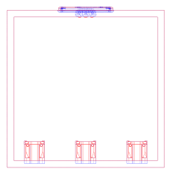](STL/Plates/Voron/300/3%20Tools/60mm%20Wide%20Dock/TPU/Split/) |
| 4 | - | - |[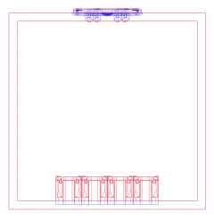](STL/Plates/Voron/300/4%20Tools/60mm%20Wide%20Dock/TPU/Center/) |[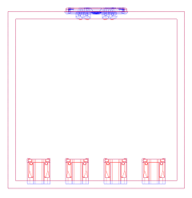](STL/Plates/Voron/300/4%20Tools/60mm%20Wide%20Dock/TPU/Split/) |
| 5 | - | - |[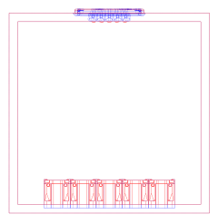](STL/Plates/Voron/300/5%20Tools/60mm%20Wide%20Dock/TPU/Center/) |[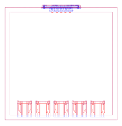](STL/Plates/Voron/300/5%20Tools/60mm%20Wide%20Dock/TPU/Split/) |
| 6 | - | - | - | |

Voron 300mm TPU 76mm Wide Dock

### Voron 300mm TPU 76mm Wide Dock
| Tool Count | Left | Right | Center | Split |
|-|-|-|-|-|
| 2 |[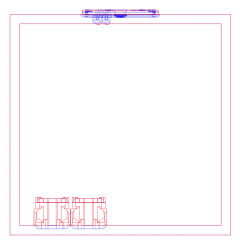](STL/Plates/Voron/300/2%20Tools/76mm%20Wide%20Dock/TPU/Left/) |[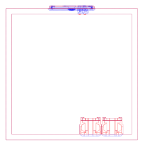](STL/Plates/Voron/300/2%20Tools/76mm%20Wide%20Dock/TPU/Right/) |[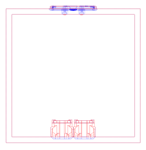](STL/Plates/Voron/300/2%20Tools/76mm%20Wide%20Dock/TPU/Center/) |[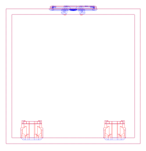](STL/Plates/Voron/300/2%20Tools/76mm%20Wide%20Dock/TPU/Split/) |
| 3 | - | - |[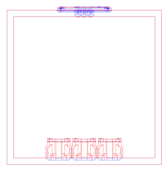](STL/Plates/Voron/300/3%20Tools/76mm%20Wide%20Dock/TPU/Center/) |[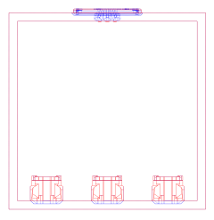](STL/Plates/Voron/300/3%20Tools/76mm%20Wide%20Dock/TPU/Split/) |
| 4 | - | - | - | |

Voron 300mm Threaded 60mm Wide Dock

### Voron 300mm Threaded 60mm Wide Dock
| Tool Count | Left | Right | Center | Split |
|-|-|-|-|-|
| 2 |[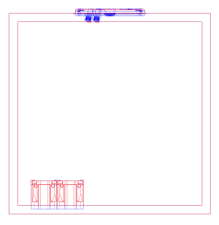](STL/Plates/Voron/300/2%20Tools/60mm%20Wide%20Dock/Threaded/Left/) |[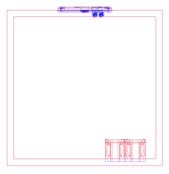](STL/Plates/Voron/300/2%20Tools/60mm%20Wide%20Dock/Threaded/Right/) |[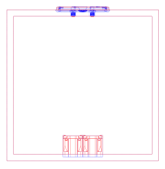](STL/Plates/Voron/300/2%20Tools/60mm%20Wide%20Dock/Threaded/Center/) |[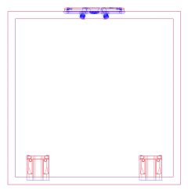](STL/Plates/Voron/300/2%20Tools/60mm%20Wide%20Dock/Threaded/Split/) |
| 3 | | | | |
| 4 | - | - | | |
| 5 | - | - | | |
| 6 | - | - | - | |

Voron 300mm Threaded 76mm Wide Dock

### Voron 300mm Threaded 76mm Wide Dock
| Tool Count | Left | Right | Center | Split |
|-|-|-|-|-|
| 2 | | | | |
| 3 | - | - | | |
| 4 | - | - | - | |

Voron 350mm TPU 60mm Wide Dock

### Voron 350mm TPU 60mm Wide Dock
| Tool Count | Left | Right | Center | Split |
|-|-|-|-|-|
| 2 | | | | |
| 3 | | | | |
| 4 | - | - | | |
| 5 | - | - | | |
| 6 | - | - | - | |

Voron 350mm TPU 76mm Wide Dock

### Voron 350mm TPU 76mm Wide Dock
| Tool Count | Left | Right | Center | Split |
|-|-|-|-|-|
| 2 | | | | |
| 3 | - | - | | |
| 4 | - | - | | |
| 5 | - | - | - | |

Voron 350mm Threaded 60mm Wide Dock

### Voron 350mm Threaded 60mm Wide Dock
| Tool Count | Left | Right | Center | Split |
|-|-|-|-|-|
| 2 | | | | |
| 3 | | | | |
| 4 | - | - | | |
| 5 | - | - | | |
| 6 | - | - | - | |

Voron 350mm Threaded 76mm Wide Dock

### Voron 350mm Threaded 76mm Wide Dock
| Tool Count | Left | Right | Center | Split |
|-|-|-|-|-|
| 2 | | | | |
| 3 | - | - | | |
| 4 | - | - | | |
| 5 | - | - | - | |

Micron 180mm TPU 60mm Wide Dock

### Micron 180mm TPU 60mm Wide Dock
| Tool Count | Left | Right | Center | Split |
|-|-|-|-|-|
| 2 | | | | |
| 3 | - | - | | |
| 4 | - | - | - | |

### Umbilical Plate Installation
If you have one, install the logo insert. The insert is indexed with a couple tabs which need to be inserted first. The bottom will press fit in to place.

The Voron face plate requires 4 heatset inserts to be installed.

Optionally you can add some foam to the mating surface of the face place.

If you have a SC Barf LED, press fit it in to the outer plate.

Mate the face plate and outer plate together by putting the face plate over one side of the ports and flexing it over the other. It may feel like the pieces don't fit at first, but with a bit of flex and force the face plate will go over all of the ports.

Install the plates on to the back panel of the printer. You need to have the panel removed from the frame or at least undo the top clips so that it can be installed from the outside of the printer.

For the Voron version, secure the back plate to the frame with 2 M5x10 BHCS screws and the outer plate to the face plate with 4 M3x8 SHCS screws.

The Micron version gets secured to the frame with 2 M3x10 SHCS and the outer plate to the face plate with 2 M2x10 self tapping screws.

If you are using the threaded back plates the spring steel/piano wire can be secured to the back plate with a M3 heat insert, M3x6 BHCS and M3 washer.

___
## Umbilical Restraints
There are 2 different ports for the umbilical plates.
- TPU - Uses a TPU printed cable relief.
- THREADED - Uses either M12x1.5 or PG7 cable glands.

There are 2 supported methods of taming the umbilical.
- Flat Spring Steel - 0.3x3mm (preferred) [Link](https://www.aliexpress.com/item/1005006731615186.html "Aliexpress")
- Piano Wire - 1mm

### TPU STL Files
To download the TPU restraint STL files select one of the links below.
###### Spring Steel
- [Voron 3.7mm cable](STL/TPU%20Umbilical/Voron/Spring/3.7mm%20Cable)
- [Voron 4mm cable](STL/TPU%20Umbilical/Voron/Spring/4mm%20Cable)
- [Voron 4.5mm cable](STL/TPU%20Umbilical/Voron/Spring/4.5mm%20Cable)
- [Voron 5mm cable](STL/TPU%20Umbilical/Voron/Spring/5mm%20Cable)
- [Voron 5.5mm cable](STL/TPU%20Umbilical/Voron/Spring/5.5mm%20Cable)
- [Voron 6mm cable](STL/TPU%20Umbilical/Voron/Spring/6mm%20Cable)
- [Voron 6.35mm cable](STL/TPU%20Umbilical/Voron/Spring/6.35mm%20Cable)
- [Micron 3.7mm cable](STL/TPU%20Umbilical/Micron/Spring/3.7mm%20Cable)
- [Micron 4mm cable](STL/TPU%20Umbilical/Micron/Spring/4mm%20Cable)
- [Micron 4.5mm cable](STL/TPU%20Umbilical/Micron/Spring/4.5mm%20Cable)
- [Micron 5mm cable](STL/TPU%20Umbilical/Micron/Spring/5mm%20Cable)
- [Micron 5.5mm cable](STL/TPU%20Umbilical/Micron/Spring/5.5mm%20Cable)
- [Micron 6mm cable](STL/TPU%20Umbilical/Micron/Spring/6mm%20Cable)
- [Micron 6.35mm cable](STL/TPU%20Umbilical/Micron/Spring/6.35mm%20Cable)
###### Piano Wire
- [Voron 3.7mm cable](STL/TPU%20Umbilical/Voron/Wire/3.7mm%20Cable)
- [Voron 4mm cable](STL/TPU%20Umbilical/Voron/Wire/4mm%20Cable)
- [Voron 4.5mm cable](STL/TPU%20Umbilical/Voron/Wire/4.5mm%20Cable)
- [Voron 5mm cable](STL/TPU%20Umbilical/Voron/Wire/5mm%20Cable)
- [Voron 5.5mm cable](STL/TPU%20Umbilical/Voron/Wire/5.5mm%20Cable)
- [Voron 6mm cable](STL/TPU%20Umbilical/Voron/Wire/6mm%20Cable)
- [Voron 6.35mm cable](STL/TPU%20Umbilical/Voron/Wire/6.35mm%20Cable)
- [Micron 3.7mm cable](STL/TPU%20Umbilical/Micron/Wire/3.7mm%20Cable)
- [Micron 4mm cable](STL/TPU%20Umbilical/Micron/Wire/4mm%20Cable)
- [Micron 4.5mm cable](STL/TPU%20Umbilical/Micron/Wire/4.5mm%20Cable)
- [Micron 5mm cable](STL/TPU%20Umbilical/Micron/Wire/5mm%20Cable)
- [Micron 5.5mm cable](STL/TPU%20Umbilical/Micron/Wire/5.5mm%20Cable)
- [Micron 6mm cable](STL/TPU%20Umbilical/Micron/Wire/6mm%20Cable)
- [Micron 6.35mm cable](STL/TPU%20Umbilical/Micron/Wire/6.35mm%20Cable)

 Optionally, there is also a TPU plug to block the ports if you do not have all of your tools built. [Link](STL/TPU%20Umbilical/Relief_Plug.stl, "TPU Plug")
### Installation
You need to print 1 Relief, 1 Terminator and enough Clips to keep your umbilical tidy (typically 4-6) per tool.
The spring steel/piano wire length should be the diagonal length of your bed + enough material for bending (~25mm). This is a good starting point for Voron printers.
#### Spring Steel
Spring steel can snap rather easily when bending. Before bending heat the area with a blow torch or lighter to a cherry red and let it cool. This makes the steel more ductile and will bend without snapping.
If there is too much friction while feeding the spring steel you can add a dab of dish washing liquid as a lubricant.
 Insert the spring steel through the strain relief and out the back. Bend it 180 degrees 12mm from the end.
 
 Do a second bend at ~60 degrees 6mm from the end that was bent in the previous step.
 
 
 Feed the spring steel through all of the clips matching the hole orientation to the strain relief. 
 Feed the spring steel through the terminator and do 2 bends at ~30 degrees. Feed the spring steel back until the bend is inside the slot for the spring steel.  
 Mount the bowden tube and cable in the strain relief and inset the strain relief into the plate. This is the time to determine the length you need. With the strain relief inserted in the back plate, run your cable to the tool while it is at the largest travel position for that specific tool. For instance, T0 would be at MAX_X and MIN_Y, The last tool would be at MIN_X and MIN_Y. Make sure that at that position there is minimal slack, but there should be some. You do not want the umbilical to be putting strain on the toolhead. Then work your way back from the toolhead and insert the bowden tube and cable into the termination print, and then the clips (which can be spaced evenly). If at any point there is too little or too much slack, pull out the strain relief and adjust it.

 Optionally you can add some heat shrink (with glue) to keep the clips from moving. 
#### Piano Wire
The procedure for piano wire is much the same as spring steel except the wire gets 2 90 degree bends at the Relief and Terminator.

___
# Credits
Developed by [N3MI-DG](https://github.com/N3MI-DG)
- [viesturz](https://github.com/viesturz) for the Tapchanger TPU umbilicals, which were the inspiration for this system.
- [hartk1213](https://github.com/hartk1213) as the umbilical plate aesthetics were recreated based on his Micron R1 exhaust plate.